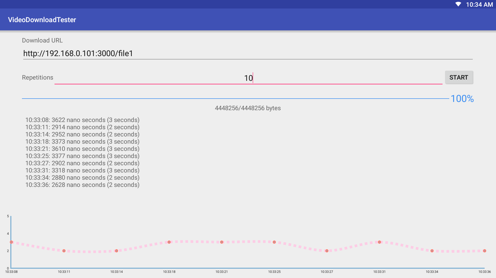
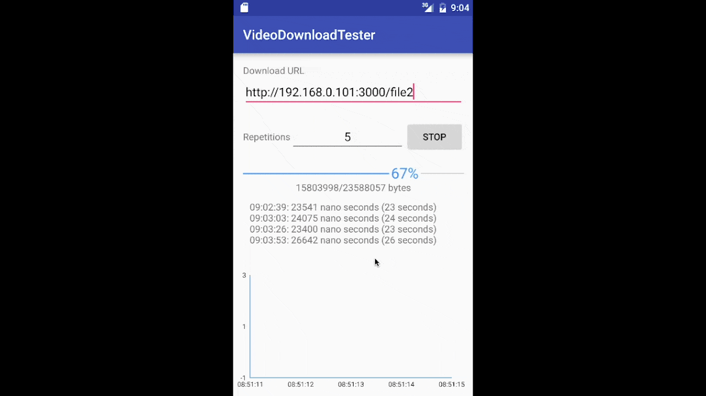

# VideoDownloadTester
Used for testing network benchmark by downloading a video (and also any file), multiple times, and then plotting the download time spent in each iteration.

Tablet or STB. 

Phone. 

